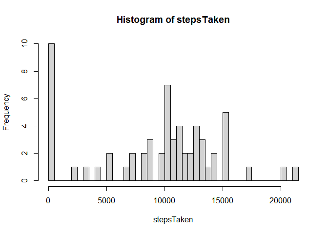
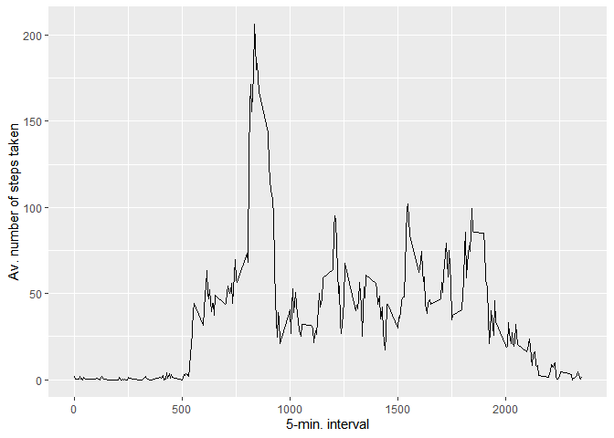
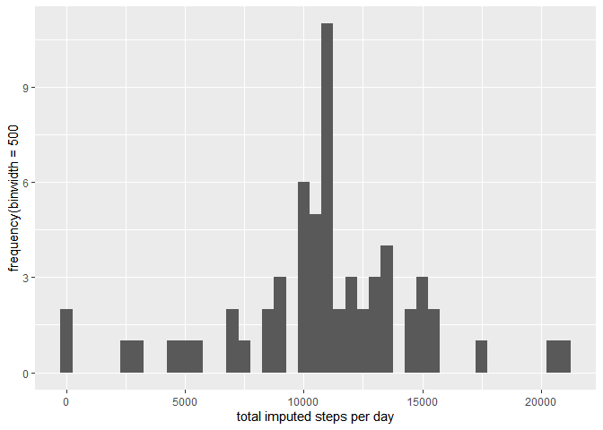
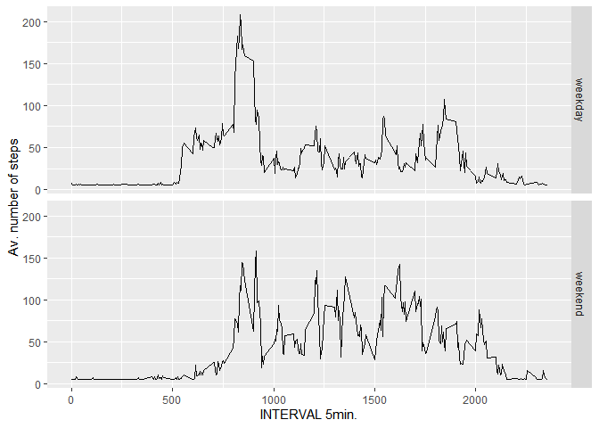

```r
library(ggplot2)
```

```
## Warning: package 'ggplot2' was built under R version 4.0.3
```

```r
library(Hmisc)
```

```
## Warning: package 'Hmisc' was built under R version 4.0.3
```

```
## Loading required package: lattice
```

```
## Loading required package: survival
```

```
## Loading required package: Formula
```

```
## Warning: package 'Formula' was built under R version 4.0.3
```

```
## 
## Attaching package: 'Hmisc'
```

```
## The following objects are masked from 'package:base':
## 
##     format.pval, units
```

## Loading and preprocessing the data

```r
activity <- read.csv("activity.csv")
activity$date <- as.Date(activity$date, "%Y-%m-%d")
```

## What is mean total number of steps taken per day?

```r
# excluding missing values
stepsTaken <- tapply(activity$steps, activity$date, sum, na.rm = T)
# making histogram
hist(stepsTaken, breaks = length(stepsTaken))
```

<!-- -->

```r
# calculate mean, median of total no. of steps
stepsMean <- mean(stepsTaken)
stepsMedian <- median(stepsTaken)
```


* MEAN : 9354.2295082
* MEDIAN : 10395


## What is the average daily activity pattern?

```r
avStepsDaily <- aggregate(x=list(meanSteps=activity$steps),by=list(interval=activity$interval),FUN=mean, na.rm=TRUE)
# making a time series plot
ggplot(data=avStepsDaily, aes(x=interval, y=meanSteps)) +
    geom_line() +
    xlab("5-min. interval") +
    ylab("Av. number of steps taken")
```

<!-- -->


## Imputing missing values
##### 1. Calculate and report the total number of missing values in the dataset 

```r
totMissingValues <- length(which(is.na(activity$steps)))
```


* Number of missing values: 2304

##### 2. Devise a strategy for filling in all of the missing values in the dataset.

```r
imputedSteps <- impute(activity$steps, mean)
```

##### 3. Create a new dataset that is equal to the original dataset but with the missing data filled in.

```r
newData <- data.frame(steps = imputedSteps, date = activity$date, interval = activity$interval)
```

##### 4. Make a histogram of the total number of steps taken each day 

```r
stepsTaken <- tapply(newData$steps, newData$date, sum)
qplot(stepsTaken, xlab = "total imputed steps per day", ylab = "frequency(binwidth = 500", binwidth = 500)
```

<!-- -->

#### 5. Calculate and report the mean and median total number of steps taken per day.

```r
stepsMeanImputed <- mean(stepsTaken)
stepsMedianImputed <- median(stepsTaken)
```

* Mean : 1.0766189\times 10^{4}
* Median :  1.0766189\times 10^{4}

Yes, the values differ from the first part. The estimated number of steps increased compared to the first part of the assignment.

## Are there differences in activity patterns between weekdays and weekends?
#### 1. Create a new factor variable in the dataset with two levels – “weekday” and “weekend” indicating whether a given date is a weekday or weekend day.

```r
#factor variable 
newData$dateType <- ifelse(as.POSIXlt(newData$date)$wday %in% c(0,6), "weekend", "weekday")
```

##### 2. Make a panel plot containing a time series plot

```r
av_newData <- aggregate(steps ~ interval + dateType, data = newData, mean)
qplot(x = interval, y = steps, data = av_newData, geom = "line", facets = (dateType~.), xlab = "INTERVAL 5min.", ylab = "Av. number of steps")
```

<!-- -->
